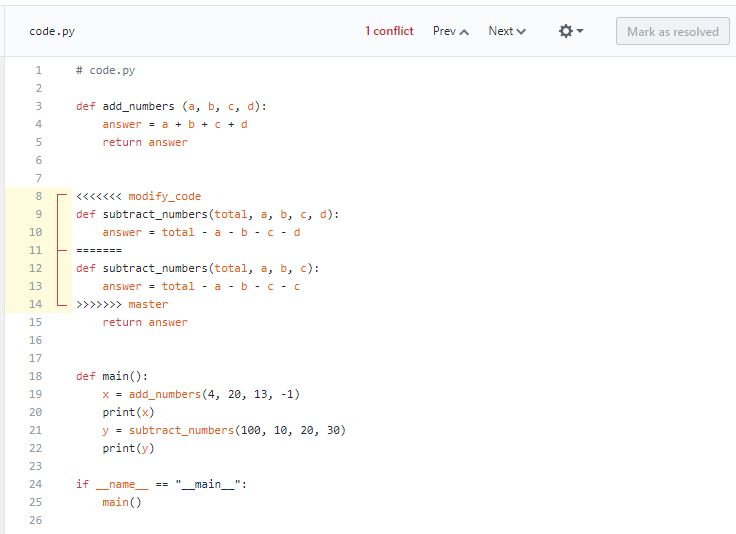

# Git and GitHub Merge Conflicts
An Example

The following file is commited to the master branch:
```
# code.py

def add_numbers (a, b, c, d):
    answer = a + b + c + d
    return answer


def subtract_numbers(total, a, b, c):
    answer = total - a - b - c 
    return answer


def main():
    x = add_numbers(4, 20, 13, -1)
    print(x)
    y = subtract_numbers(100, 10, 20, 30)
    print(y)
    
if __name__ == "__main__":
    main()
```
A branch called `modify_code` is created.  In that branch, the `code.py` file
is changed such that an additional parameter is added to the `subtract_numbers`
function:
```
def subtract_numbers(total, a, b, c, d):
    answer = total - a - b - c - d
    return answer
```
Meanwhile, back on the `master` branch, a different change was made to this 
same function where `c` is subtracted twice:
```
def subtract_numbers(total, a, b, c):
    answer = total - a - b - c - c
    return answer
```
So, different changes have been made to the same lines of code in both the 
`master` and `modify_code` branches.

### Resolve Conflict During Merge On GitHub

If a pull request is made in GitHub, the following will be seen:


Despite this warning, a pull request can be made by clicking the green `Create
Pull Request` button.  A pull request will be created with the following
message:


Clicking on the "Resolve conflicts" brings up a screen with a text editor.



The conflicts are highlighted with `<<<<<<<` and `>>>>>>>`.  
The lines between `<<<<<<< modify_code` and `=======` exist in the 
`modify_code` branch.  
The lines between `=======` and `>>>>>>> master` exist in the master branch.

The desired final changes in the merge are made by editing this section to have
the desired result, and then removing any lines containing `<<<<<<<`, `>>>>>>>`,
or `=======`.

Once all conflicts have been resolved in the editor, the "Mark as resolved"
button should become active and can be clicked, allowing for the completion of
the pull request.

### Resolve Conflict During Merge On Git Command Line
To merge the `modify_code` branch into the `master` branch in git, the `master`
branch would be checked out, and `git merge modify_cde` entered.  The result
is as follows:
```
/d/ClassRepos/git_conflict (master)
$ git merge modify_code
Auto-merging code.py
CONFLICT (content): Merge conflict in code.py
Automatic merge failed; fix conflicts and then commit the result.

/d/ClassRepos/git_conflict (master|MERGING)
$

```
A `CONFLICT` message is given.  Also, note that the branch indicator now says
`(mater|MERGING)`.  

We can see the conflicts by editing the `code.py` file in a text editor:
```
#code .py

def add_numbers(a, b, c, d):
    answer = a + b + c + d
    return answer


<<<<<<< HEAD
def subtract_numbers(total, a, b, c):
    answer = total - a - b - c - c
=======
def subtract_numbers(total, a, b, c, d):
    answer = total - a - b - c - d
>>>>>>> modify_code
    return answer


def main():
    x = add_numbers(4, 20, 13, -1)
    print(x)
    y = subtract_numbers(100, 10, 20, 30)
    print(y)


if __name__ == "__main__":
    main()
```

The conflicts are highlighted with `<<<<<<<` and `>>>>>>>`.  
The lines between `<<<<<<< HEAD` and `=======` exist in the 
`HEAD` branch, which is the `master` branch currently checked out.  
The lines between `=======` and `>>>>>>> modify_code` exist in the 
`modify_code` branch.

The desired final changes in the merge are made by editing this section to have
the desired result, and then removing any lines containing `<<<<<<<`, `>>>>>>>`,
or `=======`.

The file can then be saved.  To complete the merge, the modified file must
be added and committed to the repository as follows:
```
/d/ClassRepos/git_conflict (master|MERGING)
$ git add code.py

/d/ClassRepos/git_conflict (master|MERGING)
$ git commit -m "Fixed merge conflicts to represent modify_code branch"
[master bac021a] Fixed merge conflicts to represent modify_code branch

dwonl@DESKTOP-G8L84L6 MINGW64 /d/ClassRepos/git_conflict (master)
$
```
The branch is now simply labelled as `(master)`.